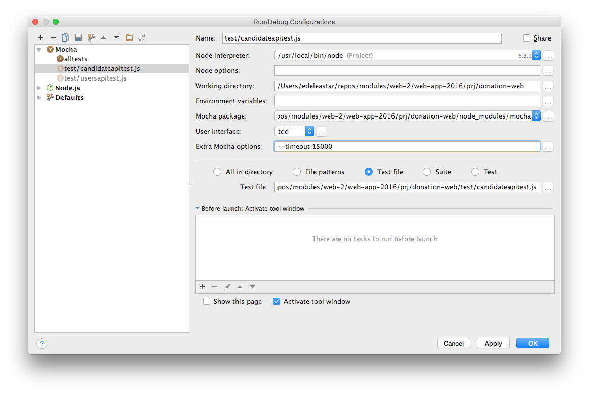

#Exercises

Here is a revised fixture including test user data:

## test/fixtures.json

~~~
{
  "donationService": "https://stormy-brushlands-56991.herokuapp.com",
  "users": [
    {
      "firstName": "Homer",
      "lastName": "Simpson",
      "email": "homer@simpson.com",
      "password": "secret"
    },
    {
      "firstName": "Marge",
      "lastName": "Simpson",
      "email": "marge@simpson.com",
      "password": "secret"
    },
    {
      "firstName": "Bart",
      "lastName": "Simpson",
      "email": "bart@simpson.com",
      "password": "secret"
    }
  ],
  "candidates": [
    {
      "firstName": "Lisa",
      "lastName": "Simpson",
      "office": "President"
    },
    {
      "firstName": "Donald",
      "lastName": "Simpson",
      "office": "President"
    }
  ],
  "newCandidate": {
    "firstName": "Barnie",
    "lastName": "Grumble",
    "office": "President"
  },
  "newUser": {
    "firstName": "Maggie",
    "lastName": "Simpson",
    "email": "maggie@simpson.com",
    "password": "secret"
  }
}
~~~

## Exercise 1: Candidates API 

Using `candidatesapitest.js` as an example, write/rewrite your `usersapitest.js` to comprehensively exercise the users api.

## Exercise 2: Deployment 

Reconfigure the candidateapitest to read the server address from the above `fixtures.json`. Deploy the application and insert the deployed app address into the `fixtures.json`. Run the tests against the deployed app.

You may notice some of the tests fail with a 'timeout error':

~~~
Error: timeout of 2000ms exceeded. Ensure the done() callback is being called in this test.
~~~

This timeout is coming from the mocha test runner, not the application. You can extend the launch configuration with additional timeout parameters:

This should enable the tests against the deployed app to run successfully to conclusion