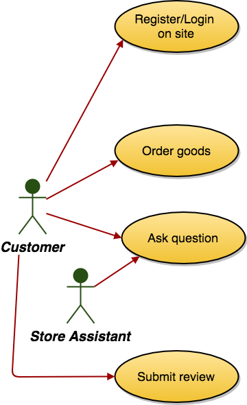

# Define normal use cases

This requires you to define the (benign) actors and how they interact with the system.

For a good concise description of Use Cases, see [this extract](http://www.computing.dcu.ie/~renaat/gdip/umldist-chap3.html) from UML Distilled, by Martin Fowler.

Note that use cases are not just diagrams. They require a diagram plus a description (according to a standard template).

You can use any drawing tool you wish for use case diagrams. The following are probably the two best options

* [draw.io](https://draw.io). In-browser drawing tool. You can find Use Case artifacts in the "UML" section
 * [Misuse cases + mitigation example that you can open in draw.io](archive/misusecases.xml)  

* [Visual Paradigm](https://www.visual-paradigm.com/download/archive/). Click "Show all operating systems" and select the "No install" version of Visual Paradigm 14.1. Unzip, run, select 30-day enterprise evaluation licence.  Then go to the *Diagram* menu and select *New->Use Case Diagram*

