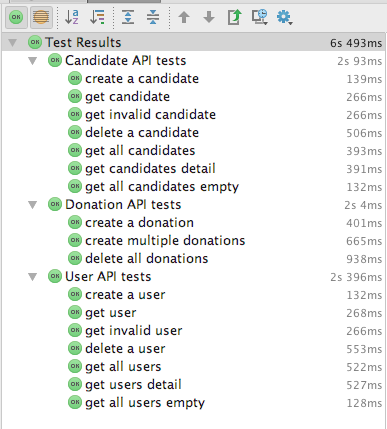
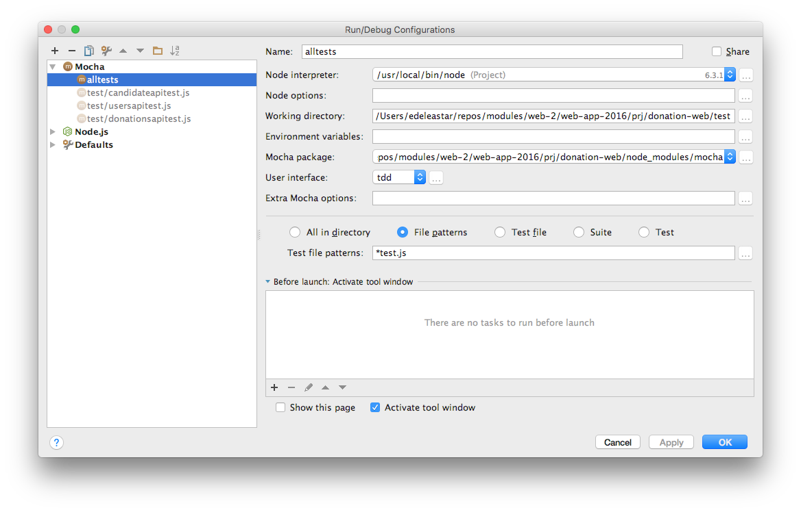

#Donations API Tests

Here are a first set of tests:

## test/donationsapitest.js

~~~
'use strict';

const assert = require('chai').assert;
const DonationService = require('./donation-service');
const fixtures = require('./fixtures.json');
const _ = require('lodash');

suite('Donation API tests', function () {

  let donations = fixtures.donations;
  let newCandidate = fixtures.newCandidate;

  const donationService = new DonationService('http://localhost:4000');

  beforeEach(function () {
    donationService.deleteAllCandidates();
    donationService.deleteAllDonations();
  });

  afterEach(function () {
    donationService.deleteAllCandidates();
    donationService.deleteAllDonations();
  });

  test('create a donation', function () {
    const returnedCandidate = donationService.createCandidate(newCandidate);
    donationService.makeDonation(returnedCandidate._id, donations[0]);
    const returnedDonations = donationService.getDonations(returnedCandidate._id);
    assert.equal(returnedDonations.length, 1);
    assert(_.some([returnedDonations[0]], donations[0]), 'returned donation must be a superset of donation');
  });

  test('create multiple donations', function () {
    const returnedCandidate = donationService.createCandidate(newCandidate);
    for (var i = 0; i < donations.length; i++) {
      donationService.makeDonation(returnedCandidate._id, donations[i]);
    }

    const returnedDonations = donationService.getDonations(returnedCandidate._id);
    assert.equal(returnedDonations.length, donations.length);
    for (var i = 0; i < donations.length; i++) {
      assert(_.some([returnedDonations[i]], donations[i]), 'returned donation must be a superset of donation');
    }
  });

  test('delete all donations', function () {
    const returnedCandidate = donationService.createCandidate(newCandidate);
    for (var i = 0; i < donations.length; i++) {
      donationService.makeDonation(returnedCandidate._id, donations[i]);
    }

    const d1 = donationService.getDonations(returnedCandidate._id);
    assert.equal(d1.length, donations.length);
    donationService.deleteAllDonations();
    const d2 = donationService.getDonations(returnedCandidate._id);
    assert.equal(d2.length, 0);
  });
});

~~~

These tests should run successfully now.

We now have a comprehensive set of tests:

In the above, all the tests have been run collectively via a `test file pattern` configuration:

You should be able to reproduce this in your IDE.