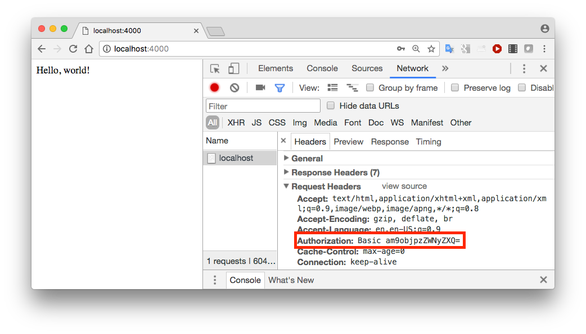

# HTTP Basic Authentication demo

This code demonstrates HTTP Basic Authentication using the *hapi-auth-basic* module

Required modules: hapi, bcrypt, hapi-auth-basic

~~~
'use strict';

const Hapi = require('hapi');

const server = new Hapi.Server();
server.connection({port:4000});

server.start((err) => {

    if (err) {
        throw err;
    }
    console.log(`Server running at: ${server.info.uri}`);
});

const Bcrypt = require('bcrypt');

const users = {
    john: {
        username: 'john',
        password: '$2a$10$iqJSHD.BGr0E2IxQwYgJmeP3NvhPrXAeLSaGCj6IR/XU5QtjVu5Tm',   // 'secret'
        name: 'John Doe',
        id: '2133d32a'
    }
};

const validate = function (request, username, password, callback) {

    const user = users[username];
    if (!user) {
        return callback(null, false);
    }

    Bcrypt.compare(password, user.password, (err, isValid) => {

        callback(err, isValid, { id: user.id, name: user.name });
    });
};

server.register(require('hapi-auth-basic'), (err) => {

    server.auth.strategy('simple', 'basic', { validateFunc: validate });
    
    server.route({ 
    	method: 'GET', 
    	path: '/', 
    	config: { auth: 'simple' } ,
    	handler: function (request, reply) {
        	reply('Hello, world!');
    	}
    });
});
~~~

To run this, save [this program (basic.js)](archive/basic.js) to a new folder and run:
<pre>
npm install hapi bcrypt hapi-auth-basic
node basic.js
</pre>

Now open a new browser tab and go to Developer Tools (right click and **Inspect** in Chrome). Select the **Network** tab and browse to http://localhost:4000. 

Observe that a **WWW-Authenticate:Basic** Response Header is set.

Entering the correct username and password (john/secret) sets an Authorization header in *all* requests to that domain until the browser is closed.  Note that this the username and password are just encoded and not encrypted. 

Try any online Base64 decoder to find what *am9objpzZWNyZXQ* maps to.

