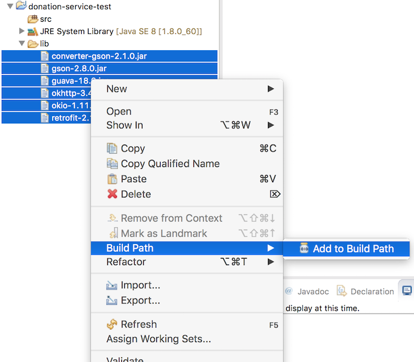

#donation-service-test

Create a new Java Project in eclipse - this time neither a play nor an Android app, just a simple Java Application. Call the Project donation-service-play-test"

Now download this archive here:

- [lib.zip](archives/lib.zip)

Expand the archive and drag/drop the folder into your project. It should now look like this:

Select all of the imported jar files, right-click, and select 'Build Path->Add to Build Path'

The project should now be configured thus:

