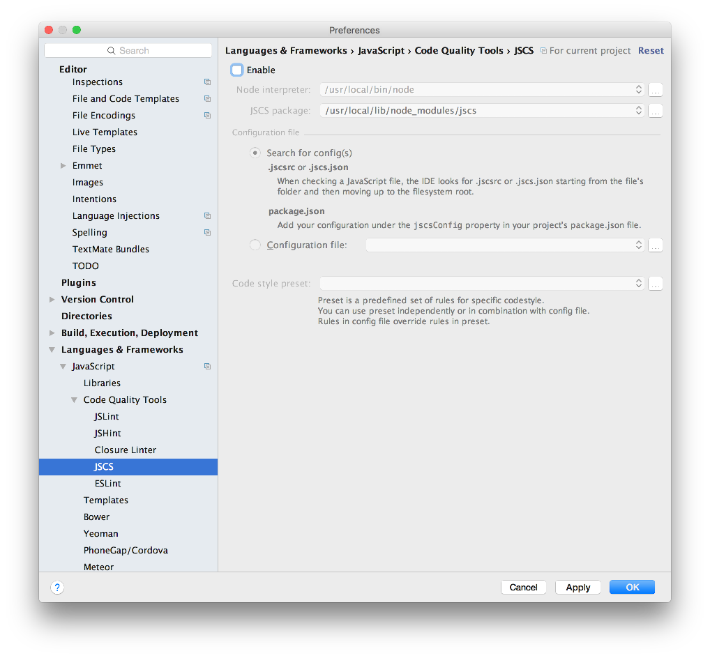
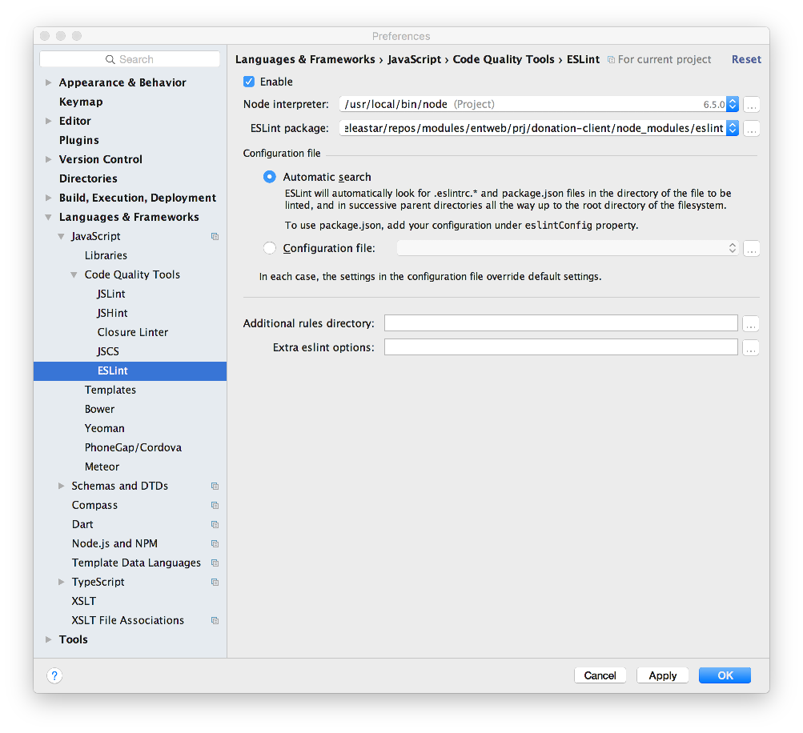

# Setup

We first need to install a new tools - the Aurelia Command Line client. This is outlined here:

- <http://aurelia.io/hub.html#/doc/article/aurelia/framework/latest/the-aurelia-cli/1>

However, we just need one command:

~~~
npm install aurelia-cli -g
~~~

In a suitable location create a new project called `donation-client`:

~~~
au new donation-client
~~~

accept all defaults...

Open in webstorm. You may need to disable jscsrc code quality tools:

and you should enable eslint:

The Eslint rules are built in to the project as generated by the cli.

We need to ammend the gitignore file to exclude generated scripts files:

## .gitignore

~~~
node_modules
.idea
.DS_STORE
scripts/app-bundle.js
scripts/app-bundle.js.map
scripts/vendor-bundle.js
~~~

You can now run the client application via this command:

~~~
au run --watch
~~~

A 'Hello World' app is now being served here:

- <http://localhost:9000/>