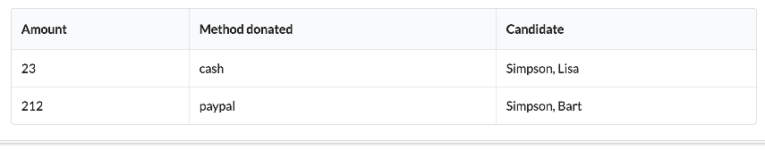

# Report

Introduce the following viewmodel + template pair to render the list of donations:

##src/viewmodels/report.js

~~~
import {inject} from 'aurelia-framework';
import DonationService from '../services/donation-service';

@inject(DonationService)
export class Report {

  donations = [];

  constructor(ds) {
    this.donationService = ds;
    this.donations = this.donationService.donations;
  }
}
~~~

##src/viewmodels/report.html

~~~
<template>

  <section class="ui stacked segment">
    <article class="eight wide column">
      <table class="ui celled table segment">
        <thead>
          <tr>
            <th>Amount</th>
            <th>Method donated</th>
            <th>Candidate</th>
          </tr>
        </thead>
        <tbody>
          <tr repeat.for="donation of donations">
            <td> ${donation.amount}</td>
            <td> ${donation.method}</td>
            <td> ${donation.candidate.lastName}, ${donation.candidate.firstName}</td>
          </tr>
        </tbody>
      </table>
    </article>
  </section>

</template>
~~~

Change `src/app.html` to include this viewmodel instead:

## src/app.html

~~~
<template>
  <compose view-model="./viewmodels/report"></compose>
</template>
~~~

The table should render - with the sample data we loaded from the fixture:

