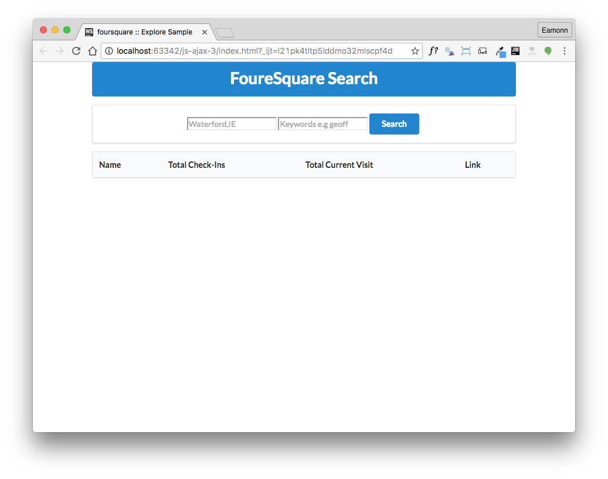

# Setup 

Create w new empty project in web-storm called `js-ajax-3`

From your previous project bring in:

- .jscsrc

If you are committing the project to git, then you might use this `.gitignore` file:

##.gitignore

~~~
.idea
node_modules
~~~

Bring in our credentials - this time in a slightly different format:

## fs-config.js

~~~
var fsConfig = {
  base_url: 'https://api.foursquare.com/v2/venues/explore?',
  client_id: 'Your ID',
  client_secret: 'Your Secret',
};
~~~

Introduce this index page:

## index.html

~~~
<html>
  <head>
    <title>foursquare :: Explore Sample</title>
    <link href='https://fonts.googleapis.com/css?family=Open+Sans' rel='stylesheet' type='text/css'>
    <link rel="stylesheet" href="https://cdnjs.cloudflare.com/ajax/libs/semantic-ui/2.2/semantic.min.css" type="text/css">
    
    
  </head>
  <body>
    <section class="ui container">
      

        <h1 class="ui header">FoureSquare Search</h1>
      

      

        <input type="text" name="location" id="location_name" placeholder="Waterford,IE" class="search-input">
        <input type="text" name="venue_keyword" id="venue_keyword" placeholder="Keywords e.g geoff"
               class="search-input">
        <button id="search_btn" class="ui primary button">Search</button>
      

      <table class="ui table" id="venue_table">
        <thead>
          <tr>
            <th>Name</th>
            <th>Total Check-Ins</th>
            <th>Total Current Visit</th>
            <th>Link</th>
          </tr>
        </thead>
      </table>
    </section>
  </body>
</html>
~~~

Opening in the browser, it should look like this:

