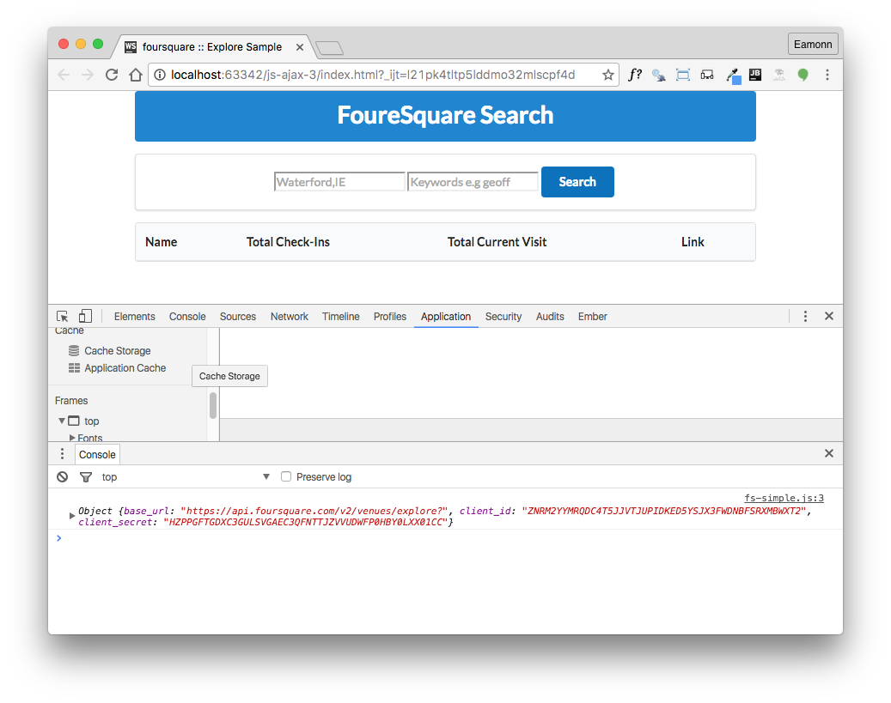

# fs-simple.js

Introduce the following file into your project:

## fs-simple.js

~~~
$('#search_btn').click(function () {
  console.log(fsConfig);
});
~~~

To incorporate this script into our web page, we need to included it on the `index.html` page. 

## index.html

~~~
    </section>
    
    
  </body>
</html>
~~~

Note we are including both js files. Browsing now - and opening the developer tools in chome - we should see this:

