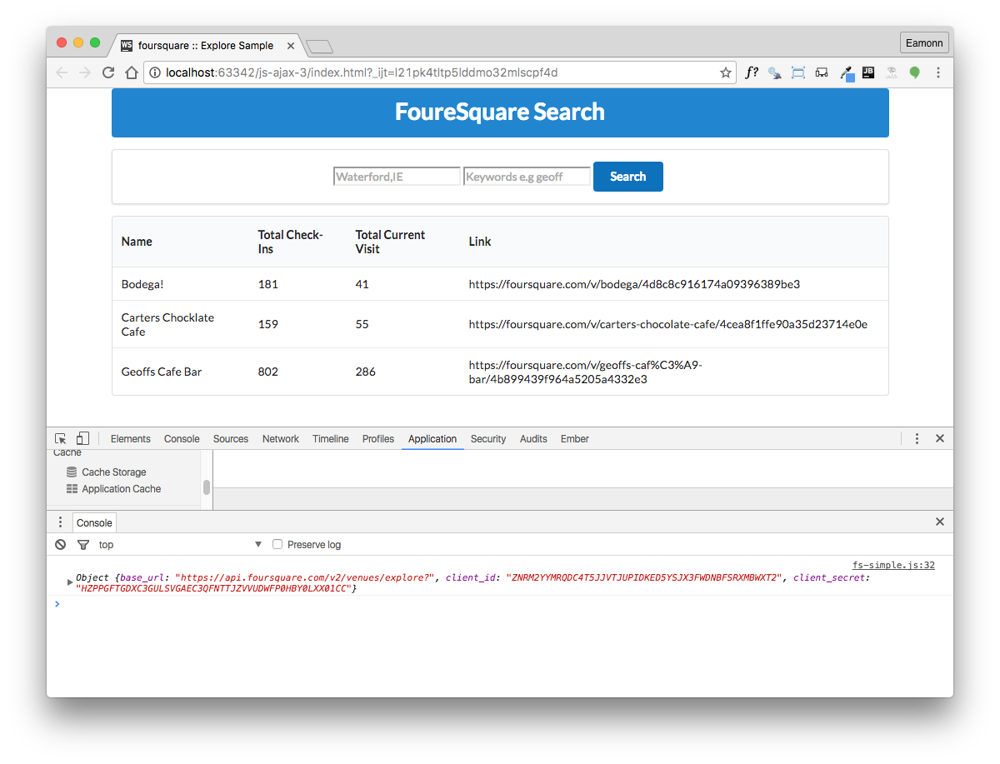

# Populate the Table

In order to rest out the view, we introduce some test data into the `fs-simple.js` script:

~~~
const checkinTestData = [
  {
    name: 'Bodega!',
    checkins: 181,
    users: 41,
    link: 'https://foursquare.com/v/bodega/4d8c8c916174a09396389be3',
  },
  {
    name: 'Carters Chocklate Cafe',
    checkins: 159,
    users: 55,
    link: 'https://foursquare.com/v/carters-chocolate-cafe/4cea8f1ffe90a35d23714e0e',
  },
  {
    name: 'Geoffs Cafe Bar',
    checkins: 802,
    users: 286,
    link: 'https://foursquare.com/v/geoffs-caf%C3%A9-bar/4b899439f964a5205a4332e3',
  },
];
~~~

We can populate the table using JQuery - this helper function here will keep our code simple:

~~~
function displayCheckins(checkins) {
  for (var i = 0; i < checkins.length; i++) {
    $('#venue_table').append('<tr><td>' + checkins[i].name + '</td>' +
        '<td>' + checkins[i].checkins + '</td>' +
        '<td>' + checkins[i].users + '</td>' +
        '<td>' + checkins[i].link + '</td></tr>');
  }
}
~~~

Now we can test it out:

~~~
$('#search_btn').click(function () {
  console.log(fsConfig);
  displayCheckins(checkinTestData);
});
~~~

We should see:

The Template Literals feature in ES6

- <https://developer.mozilla.org/en/docs/Web/JavaScript/Reference/Template_literals>

.. can make out `displayCheckins` function considerably easier to maintain:

~~~
function displayCheckins(checkins) {
  for (var i = 0; i < checkins.length; i++) {
    $('#venue_table').append(`
      <tr>
        <td>  ${checkins[i].name}  </td>
        <td>  ${checkins[i].checkins}  </td>
        <td>  ${checkins[i].users} </td>
        <td>  ${checkins[i].link}  </td>
      </tr>`);
  }
}
~~~

Note that the above uses the `backtick` character to open and close the string.

And we can even further simplify by using a forEach loop:

~~~
function displayCheckins(checkins) {
  for (let checkin of checkins) {
    $('#venue_table').append(`
      <tr>
        <td>  ${checkin.name}  </td>
        <td>  ${checkin.checkins}  </td>
        <td>  ${checkin.users} </td>
        <td>  ${checkin.link}  </td>
      </tr>`);
  }
}
~~~

