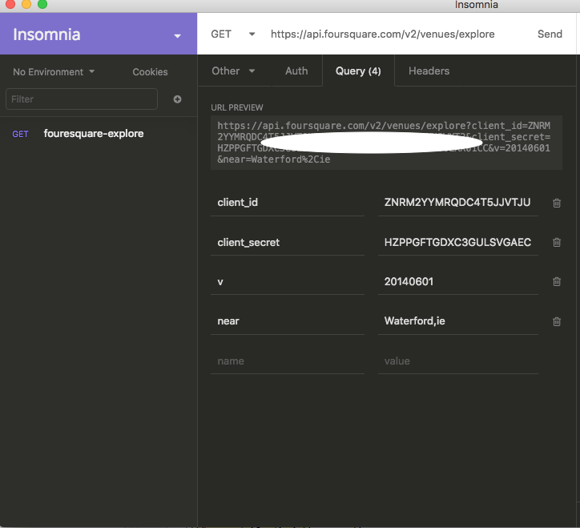
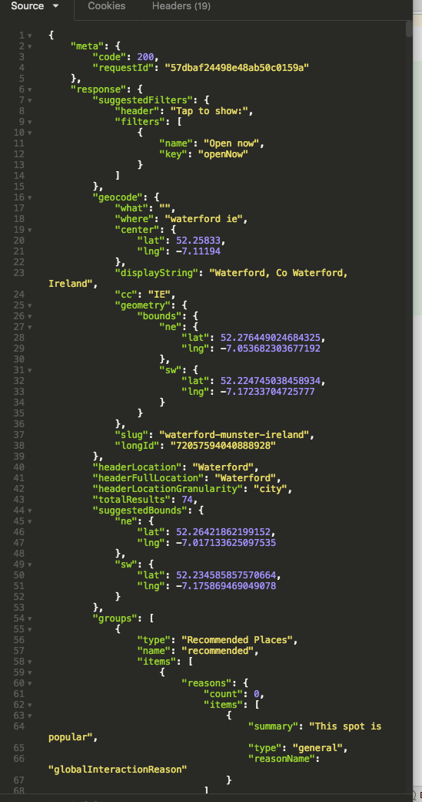

# Insomnia REST Client

You may have downloaded this client in the last lab:

- <https://insomnia.rest/>

Lets configure it now to make some requests. See if you can replicate exactly the following request configuration:

Pressing send will return a successful response:

Retrieving photos is not so easy however. In fact no photo information is returned by default anyway. Looking in the Json, we see something like this for all venues:

~~~
              "photos": {
                "count": 0,
                "groups": []
              },
~~~

However, we will get at least 1 photo if we add the the `&venuePhotos=1` query parameter:

If you configure Insomnia as above, we should see something like this in the photos section for a venue:

~~~
"photos": {
                "count": 1,
                "groups": [
                  {
                    "type": "venue",
                    "name": "Venue photos",
                    "count": 1,
                    "items": [
                      {
                        "id": "574dcae938fa4728d875ac07",
                        "createdAt": 1464716009,
                        "prefix": "https://irs3.4sqi.net/img/general/",
                        "suffix": "/9538229_6Jw8lswCJJ-vI3WTCY1EZ-CDS-9oEzbSoWelXG1Scyc.jpg",
                        "width": 1434,
                        "height": 1919,
                        "user": {
                          "id": "9538229",
                          "firstName": "Ed",
                          "lastName": "Schmitt",
                          "gender": "male",
                          "photo": {
                            "prefix": "https://irs1.4sqi.net/img/user/",
                            "suffix": "/4NFJINQ2PM2I22Y1.jpg"
                          }
                        },
                        "visibility": "public"
                      }
                    ]
                  }
                ]
              },
~~~

The full photo url will need to be patched together programatically from this. See:

- <https://developer.foursquare.com/docs/responses/photo>

So, for instance in the above response, the actual image url is:

- <https://irs3.4sqi.net/img/general/original/9538229_6Jw8lswCJJ-vI3WTCY1EZ-CDS-9oEzbSoWelXG1Scyc.jpg>

This is the `original` resolution, other formats are also available.

