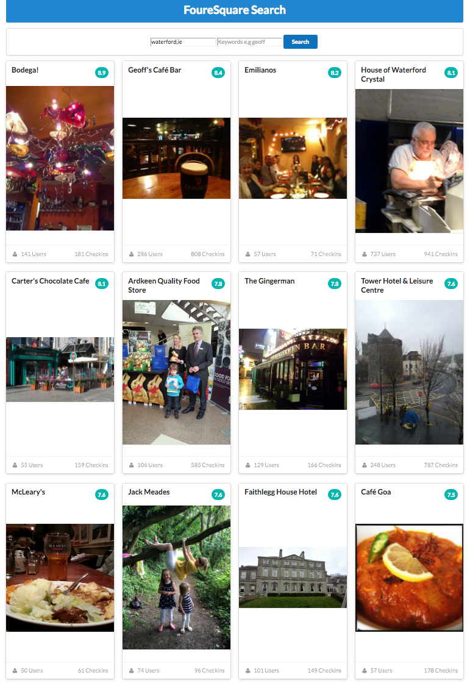

## Fetching Images

To retrieve images programatically, we extend the query parameter to include `&venuePhotos=1`

~~~
  var requestOptions = {
    url: fsConfig.base_url + 'near=' + locationName + '&query=' + venueKeyword + '&venuePhotos=1' + fsCredentials,
    method: 'GET',
    json: {},
  };
~~~

This will make sure we get the additional photo info in the response.

We could display the images in a table - but Semantic-UI has an attractive Pintrest style card layout it would be interesting to use:

- <http://semantic-ui.com/views/card.html>

First, completely replace the `<table>` in index.html with a container for these cards:

~~~
      

      

~~~

Notice we are using a `link` card:

- <http://semantic-ui.com/views/card.html#link-card>

They are also `stackable`

- <http://semantic-ui.com/views/card.html#stackable>

... and we have a `column count` for the cards:

- <http://semantic-ui.com/views/card.html#column-count>

We change `locationVenues` function to take a jQuery reference to this container:

~~~
  loadVenues(locationName, venueKeyword, $('#venue_cards'));
~~~

.. and this is a revised version of the loadVenues functions:

~~~
function loadVenues(locationName, venueKeyword, cardSection) {
  var requestOptions = {
    url: fsConfig.base_url + 'near=' + locationName + '&query=' + venueKeyword + '&venuePhotos=1' + fsCredentials,
    method: 'GET',
    json: {},
  };
  $.getJSON(requestOptions.url, {}, body => {
    const venues = body.response.groups[0].items;
    const checkins = [];
    for (let venue of venues) {
      const checkin = {
        name: venue.venue.name,
        checkins: venue.venue.stats.checkinsCount,
        users: venue.venue.stats.usersCount,
        url: venue.venue.url,
        rating: venue.venue.rating,
      };
      checkins.push(checkin);
    }

    displayCheckins(checkins, cardSection);
  });
}
~~~

This is more or less the same as the previous version. 

We need to completely rewrite the `displayCheckins` function however:

~~~
function displayCheckins(checkins, cardSection) {
  for (let checkin of checkins) {
    cardSection.append(`
        <a class="ui link raised card" href="${this.url}">
          

            

              
 ${checkin.rating}

            

            
${checkin.name}

          

          

            
          

          

          

          

            
              ${checkin.checkins} Checkins
            
            
              <i class="user icon"></i>
              ${checkin.users} Users
            
          

        </a>`);
  }
}
~~~

Try this now - it will populate a set of cards, but the images will be undefined. 

Before we call push the checkin onto the array, we need to build the imageUrl:

~~~
      if (venue.venue.photos.count) {
        const prefix = venue.venue.photos.groups[0].items[0].prefix;
        const suffix = venue.venue.photos.groups[0].items[0].suffix;
        checkin.imageUrl = prefix + 'original' + suffix;
      }

      checkins.push(checkin);
~~~

Try this now - we should see something like this:

This is the complete code:

##fs-simple.js

~~~
var fsCredentials = '&client_id=' + fsConfig.client_id + '&client_secret=' + fsConfig.client_secret + '&v=20140601';

function displayCheckins(checkins, cardSection) {
  for (let checkin of checkins) {
    cardSection.append(`
        <a class="ui link raised card" href="${this.url}">
          

            

              
 ${checkin.rating}

            

            
${checkin.name}

          

          

            
          

          

          

          

            
              ${checkin.checkins} Checkins
            
            
              <i class="user icon"></i>
              ${checkin.users} Users
            
          

        </a>`);
  }
}

function loadVenues(locationName, venueKeyword, cardSection) {
  var requestOptions = {
    url: fsConfig.base_url + 'near=' + locationName + '&query=' + venueKeyword + '&venuePhotos=1' + fsCredentials,
    method: 'GET',
    json: {},
  };
  $.getJSON(requestOptions.url, {}, body => {
    const venues = body.response.groups[0].items;
    const checkins = [];
    for (let venue of venues) {
      const checkin = {
        name: venue.venue.name,
        checkins: venue.venue.stats.checkinsCount,
        users: venue.venue.stats.usersCount,
        url: venue.venue.url,
        rating: venue.venue.rating,
      };

      if (venue.venue.photos.count) {
        const prefix = venue.venue.photos.groups[0].items[0].prefix;
        const suffix = venue.venue.photos.groups[0].items[0].suffix;
        checkin.imageUrl = prefix + 'original' + suffix;
      }

      checkins.push(checkin);
    }

    displayCheckins(checkins, cardSection);
  });
}

$('#search_btn').click(function () {
  $('#venue_table tbody').remove();
  const locationName = $('#location_name').val();
  const venueKeyword = $('#venue_keyword').val();
  loadVenues(locationName, venueKeyword, $('#venue_cards'));
});

~~~

