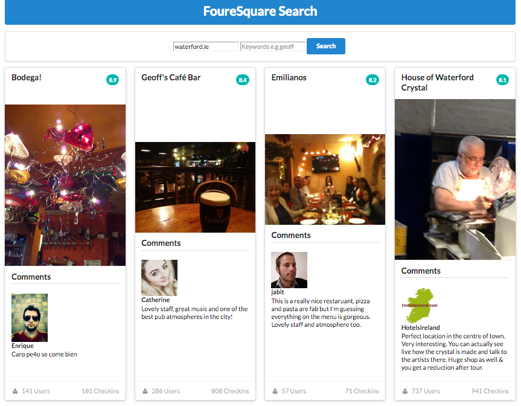

# Exercises

Archive of project:

- <https://github.com/wit-ictskills-2016/js-ajax-3>

## Exercise 1:

Here is a possible extension to the ui to show 'top tips':

These are visible on the foursquare web app itself:

- <https://foursquare.com/explore?mode=url&near=Waterford%2C%20Co%20Waterford%2C%20Ireland&nearGeoId=72057594040888928>

Extend the card to include this information. There will be no need to change any of the request parameters. Use Insomnia to locate these tips, and try to render them into the card.