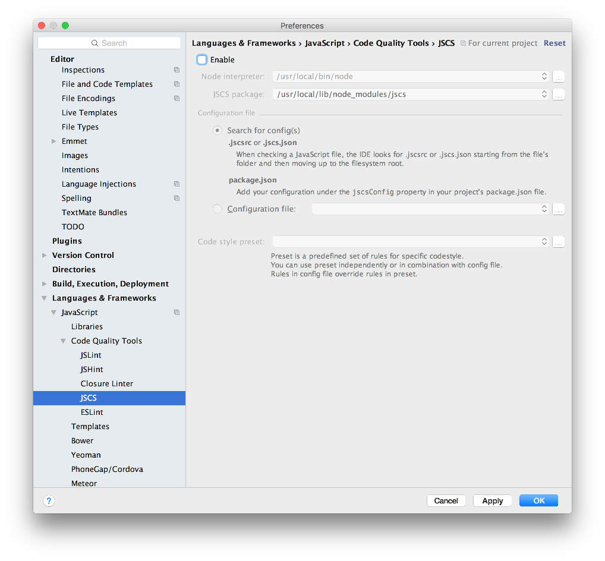

# Setup

We first need to install a new tools - the Aurelia Command Line client. This is outlined here:

- <http://aurelia.io/hub.html#/doc/article/aurelia/framework/latest/the-aurelia-cli/1>

However, we just need one command:

~~~
npm install aurelia-cli -g
~~~

In a suitable location create a new project called `donation-client`:

~~~
au new donation-client
~~~

accept all defaults, EXCEPT the very first option. instead of `ESNext` select `Typescript` (this is selected by entering 2 for the first option).

Open in webstorm. You may need to disable jscsrc code quality tools:

Instead, for formatting Typescript - we will use this tool here:

- <https://prettier.io>

To install into Webstorm, follow this guide here:

- <https://medium.com/@jm90mm/adding-prettier-to-webstorm-a218eeec04d2>

Open `src/main.ts` - you will be prompted to compile Typescript to JavaScript:

Select `OK`

Also, run the prettier formatter on the same file - it should reformat the code as shown:

Reformat the other two ts files in the src folder - and commit the project to git.