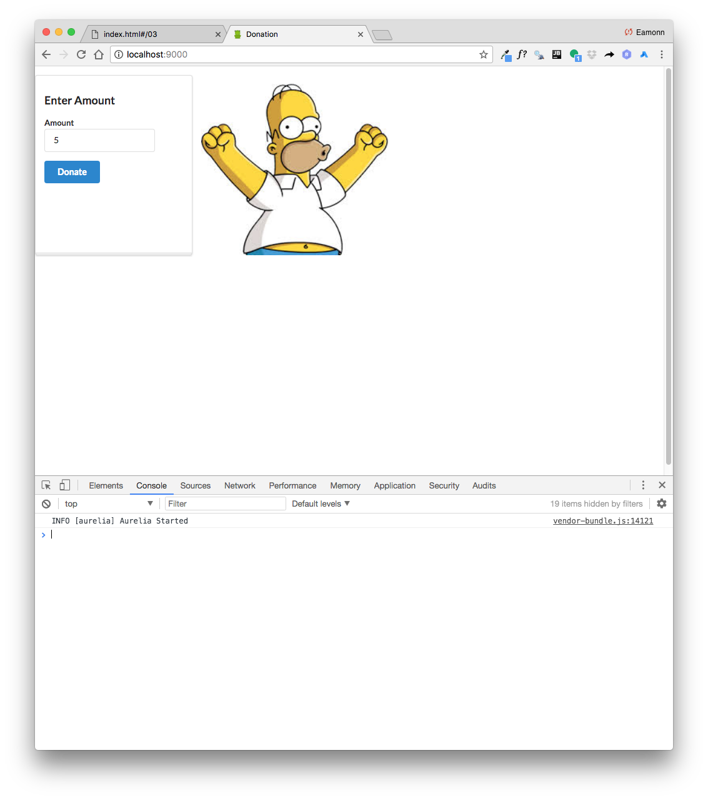
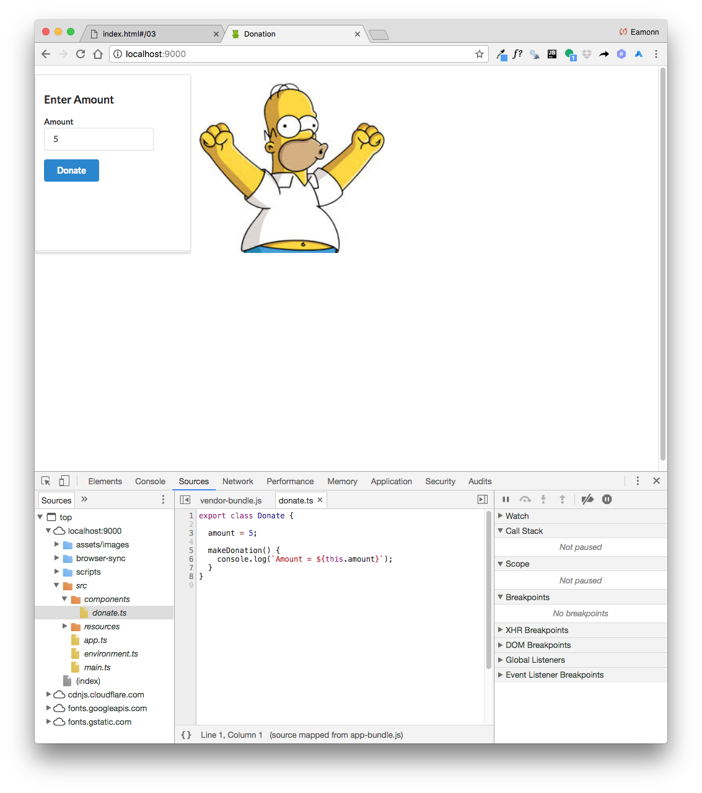
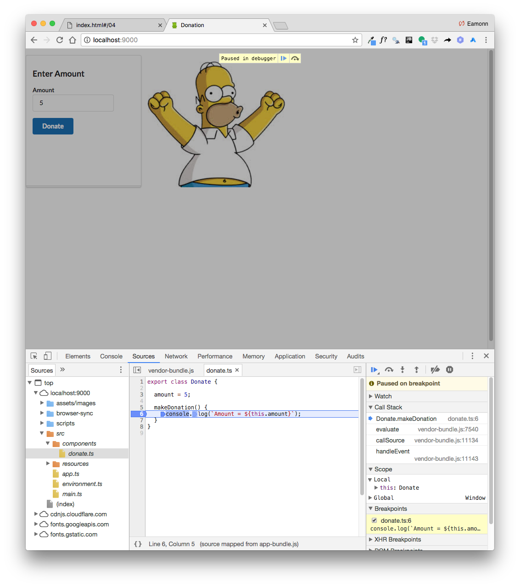

# First View/Model

Create a folder in `src` called `components`. Include these new files in this folder:

## src/components/donate.html

~~~
<template>
  <section class="ui two column stackable grid basic segment">
    
    <form submit.trigger="makeDonation()" class="ui form four wide column stacked segment">

      

        <h3>Enter Amount </h3>
        

          <label>Amount</label> <input type="number" value.bind="amount">
        

      

      <button class="ui blue submit button">Donate</button>

    </form>

    <aside class="ui wide twelve wide center aligned middle aligned column">
      
    </aside>

  </section>
</template>
~~~

## src/components/donate.js

~~~
export class Donate {

  amount = 5;

  makeDonation() {
    console.log(`Amount = ${this.amount}`);
  }
}
~~~

Now edit `src/app.html` to include this view/model into the app:

~~~
<template>
  <compose view-model="./components/donate"></compose>
</template>
~~~

Browse the app now (make sure it is still running), and a first version of a donation form should be visible. Open the developer tools, so you can see the console log:

This log should be updated live as you press the donation button.

Also, open the Sources tab, and locate and open the donate.ts source:

Experiment with dropping a breakpoint on donate:

