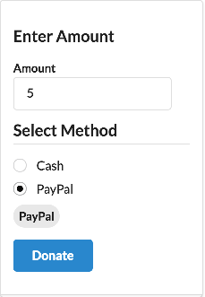

# Binding

In `donate.html`, introduce a new element to capture the payment method:

## src/components/donate.html
~~~
      

        <h3 class="ui dividing header"> Select Method </h3>
        

          

            <input type="radio" model.bind="method" checked.bind="selectedMethod">
            <label>${method}</label>
          

        

        <label class="ui circular label"> ${selectedMethod} </label>
      

~~~

Place this just before the submit button element in the form. Revise the viewmodel class to include extra fields for the bound properties:

~~~
export class Donate {

  amount = 5;
  methods = ['Cash', 'PayPal'];
  selectedMethod = 'Cash';

  makeDonation() {
    console.log(`Amount = ${this.amount}`);
    console.log(`Method = ${this.selectedMethod}`);
  }
}
~~~

Test the app now - the donation panel should look like this:

As you press the radio button, note how the on screen label changes. Also, keep an eye on the console log for updates from the event handler.

Now look carefully at the Donate class - notice how simple it is, and how the visual components are automatically `bound` to the class attributes.

We can continue working on this view to support a candidate list. First, we define some candidates in the donate class:

## src/components/donate.js

~~~
export class Donate {

  amount = 5;
  methods = ['Cash', 'PayPal'];
  selectedMethod = 'Cash';

  candidates = [
    {
      firstName: 'Lisa',
      lastName: 'Simpson'
    },
    {
      firstName: 'Bart',
      lastName: 'Simpson'
    }
  ];
  selectedCandidate = this.candidates[0];

  makeDonation() {
    console.log(`Amount = ${this.amount}`);
    console.log(`Method = ${this.selectedMethod}`);
    console.log(`Candidate = ${this.selectedCandidate.firstName} ${this.selectedCandidate.lastName}`);
  }
}
~~~

This is the candidate list view elements

##src/components/donate.html

~~~
      

        <h3 class="ui dividing header"> Select Candidate </h3>
        

          

            <input type="radio" model.bind="candidate" checked.bind="selectedCandidate">
            <label>${candidate.lastName}, ${candidate.firstName}</label>
          

        

        <label class="ui circular label"> ${selectedCandidate.firstName} ${selectedCandidate.lastName}</label>
      

~~~

Try this out now and verify, by examining the console log, that the viewmodel is updated as expected.

