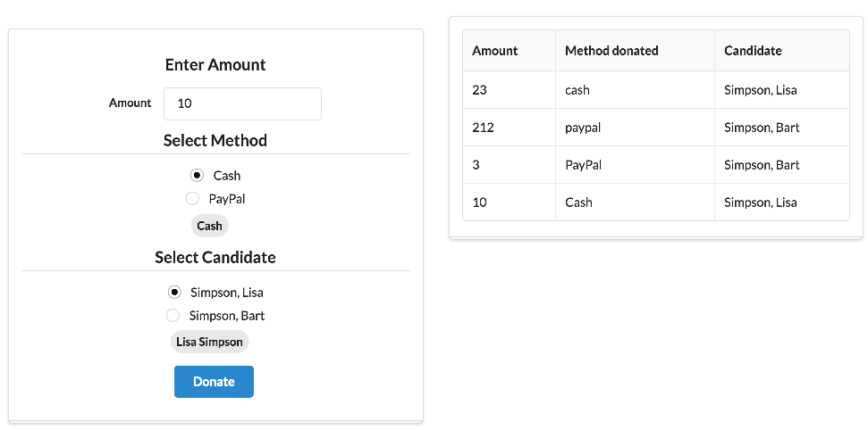

# Viewmodel Composition

We would like to display both viewmodels on the same page, and explore how databinding works in practice.

First, simplify `donate.html` by removing the image and simplifying the layout slightly:

## src/viewmodels/donate.html

~~~
<template>
  <section class="ui two column stackable grid basic segment">

    <form submit.trigger="makeDonation()" class="ui form  column stacked segment">

      

        <h3>Enter Amount </h3>
        

          <label>Amount</label> <input type="number" value.bind="amount">
        

      

      

        <h3 class="ui dividing header"> Select Method </h3>
        

          

            <input type="radio" model.bind="method" checked.bind="selectedMethod">
            <label>${method}</label>
          

        

        <label class="ui circular label"> ${selectedMethod} </label>
      

      

        <h3 class="ui dividing header"> Select Candidate </h3>
        

          

            <input type="radio" model.bind="candidate" checked.bind="selectedCandidate">
            <label>${candidate.lastName}, ${candidate.firstName}</label>
          

        

        <label class="ui circular label"> ${selectedCandidate.firstName} ${selectedCandidate.lastName}</label>
      

      <button class="ui blue submit button">Donate</button>

    </form>

  </section>
</template>
~~~

Now we can replace the current `app.html` with a version that composes a view from the two viewmodels:

## src/app.html

~~~
<template>

  <section class="ui two column stackable grid basic center aligned segment">
    <aside class="column">
      <compose view-model="./viewmodels/donate"></compose>
    </aside>
    <article class="column">
      <compose view-model="./viewmodels/report"></compose>
    </article>
  </section>

</template>
~~~

The app should now render like this:

The nature of databinding in the app now is such that the donation list view is automatically synchronised with the donate view model. Try it now, and confirm that the report view will be expanded as you make donations.

