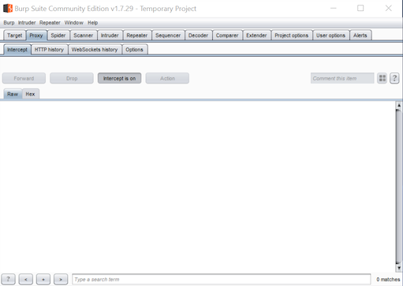

# Installation

Burp is available in Professional (paid for) and Community (free) editions.  The Community edition will suffice for this lab.

Download the Community Edition from [https://portswigger.net/burp](https://portswigger.net/burp).  Choose the plain JAR file (requires that you have Java installed).

On startup, select "Temporary project" (default).

On the next screen, select "Use Burp defaults".

This will bring you to the main Burp view.  Select the "Proxy" tab.

Burp is now ready to intercept traffic to/from any website you choose.  