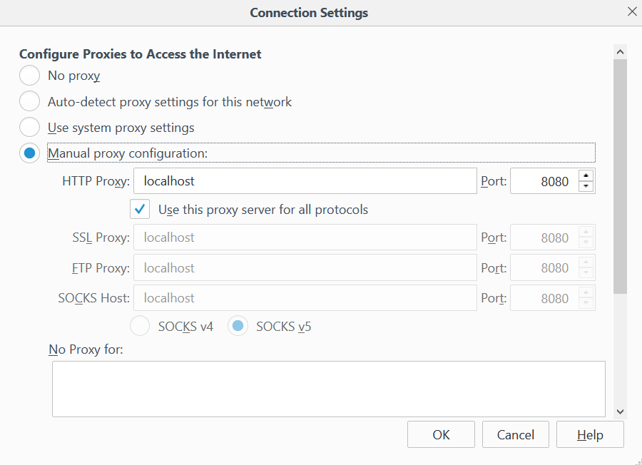

# Browser configuration

Configure your web browser to point to Burp as a proxy. I recommend using [Firefox](https://www.mozilla.org/en-US/firefox/) for this. 

In Firefox, you can find the proxy settings by going to "Options", then "Advanced", then "Network", then "Settings". Enter localhost as the HTTP proxy, and <b>8080</b> as the port. 

Set this as the proxy for all protocols and remove the reference to localhost from the No Proxy for: box. 

