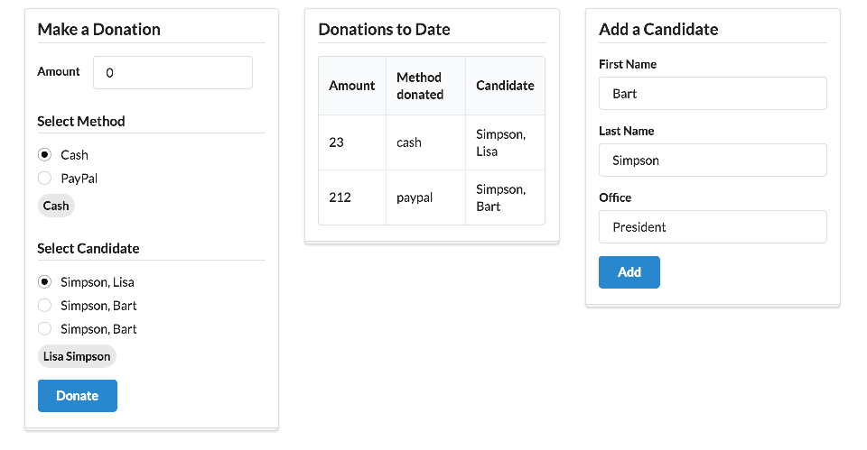

# Lab Aurelia 1 Exercise Solutions

This is a new method in the `DonationService` class, which will add a new candidate:

## src/services/donation-service.js

~~~
  addCandidate(firstName, lastName, office) {
    const candidate = {
      firstName: firstName,
      lastName: lastName,
      office: office
    };
    this.candidates.push(candidate);
  }
~~~

.. and this is the implementation of the `Candidates` viewmodel class to accompany the `candidates.html` template:

## src/viewmodels/candidates.js

~~~
import {inject} from 'aurelia-framework';
import DonationService from '../services/donation-service';

@inject(DonationService)
export class Candidate {

  firstName = '';
  lastName = '';
  office = '';

  constructor(ds) {
    this.donationService = ds;
  }

  addCandidate() {
    this.donationService.addCandidate(this.firstName, this.lastName, this.office);
  }
}
~~~

Now we can include this viewmodel in `app.html`:

## src/app.html

~~~
<template>

  

    <section class="ui three column stackable grid basic segment">
      

        <aside class="column">
          <compose view-model="./viewmodels/donate"></compose>
        </aside>
        <article class="column">
          <compose view-model="./viewmodels/report"></compose>
        </article>
        <article class="column">
          <compose view-model="./viewmodels/candidates"></compose
        </article>
      

    </section>
  

</template>
~~~

This should render as shown:

Our existing data binding strategies should ensure that entering a new candidate should nicely propagate to the donate viewmodel.

