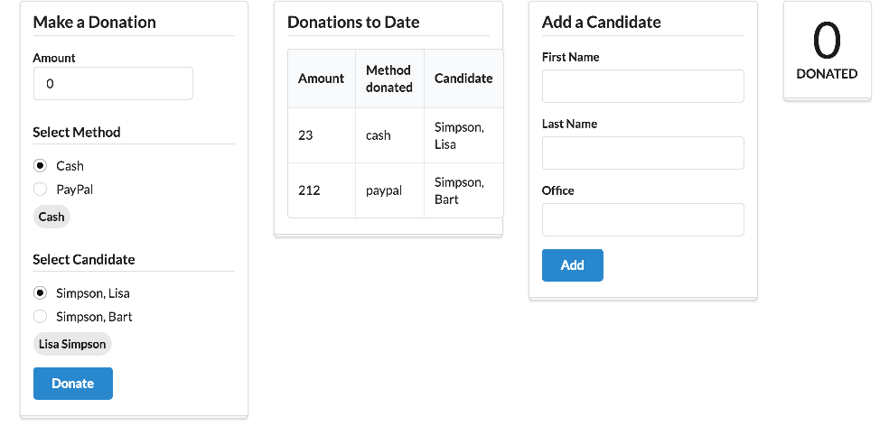

# Stats Viewmodel

We would like to display the total amount donated so far. To prepare for this, we can extend donation-service to track and accumulate this as a `total` attribute:

## src/donation-service.js

~~~
export default class DonationService {
  ...
  ...
  total = 0;
  ...
  ...
  donate(amount, method, candidate) {
    ...
    ...

    this.total = this.total + parseInt(amount, 10);
    console.log('Total so far ' + this.total);
  }

  ...
  ...   
} 
~~~

Include the above now and make sure the total are appearing in the (browser) console.

Here is our first attempt at a component to display the total:

## src/viewmodels/stats.html

~~~
<template>

  <section class="ui stacked statistic segment">
    

      ${total}
    

    

      Donated
    

  </section>

</template>
~~~

##src/viewmodels/stats.js

~~~
import {inject} from 'aurelia-framework';
import DonationService from '../services/donation-service';

@inject(DonationService)
export class Stats {

  total = 0;

  constructor(ds) {
    this.donationService = ds;
    this.total = ds.total;
  }
}
~~~

We can include it in our main view:

## src/app.html

~~~
<template>

  

    <section class="ui four column stackable grid basic segment">
      

        <aside class="column">
          <compose view-model="./viewmodels/donate"></compose>
        </aside>
        <article class="column">
          <compose view-model="./viewmodels/report"></compose>
        </article>
        <article class="column">
          <compose view-model="./viewmodels/candidates"></compose>
        </article>
        <article class="column">
          <compose view-model="./viewmodels/stats"></compose>
        </article>
      

    </section>
  

</template>
~~~

This should render like this:

Try making donations now - you will notice that our stat view is not updating! Can you explain why?
