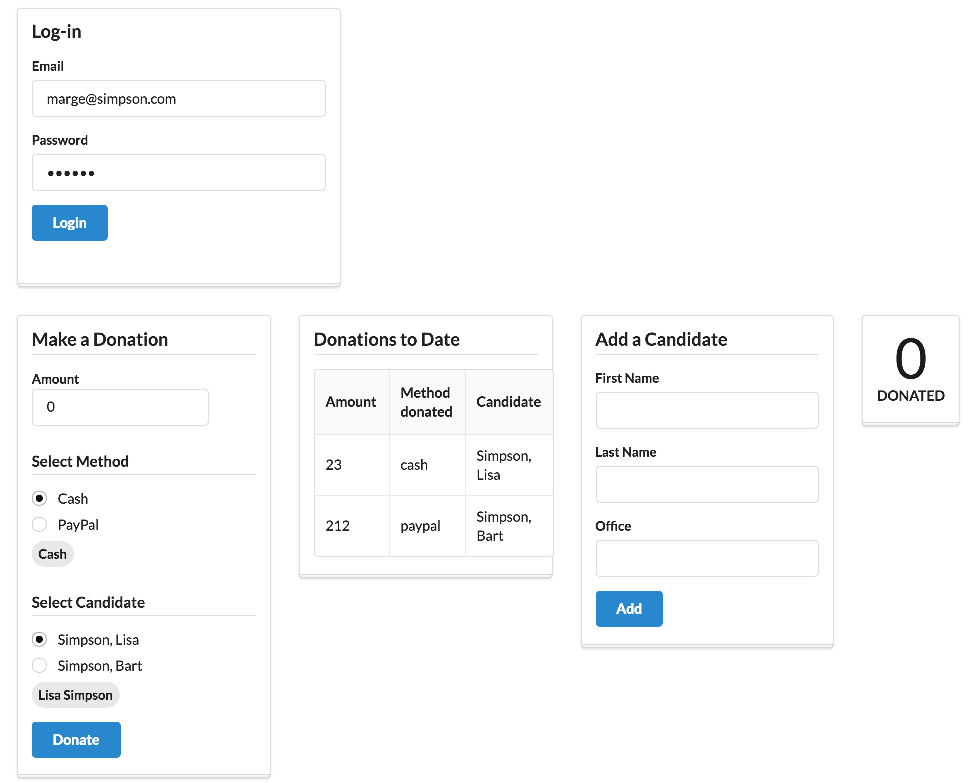

# Login 

We might like to have a user log in before we allow donations etc.. Bring in this template:

## src/viewmodels/login.html

~~~
<template>

  <form submit.delegate="login($event)" class="ui stacked segment form">
    <h3 class="ui header">Log-in</h3>
    

      <label>Email</label> <input placeholder="Email" value.bind="email"/>
    

    

      <label>Password</label> <input type="password" value.bind="password"/>
    

    <button class="ui blue submit button">Login</button>
    <h3>${prompt}</h3>
  </form>

</template>
~~~

Note that we are not using a viewmodel class with this template. We can bring in this 'viewmodelless' view into `app.html`:

## src/app.html

~~~
<template>

  

    <section class="ui four column stackable grid basic segment">
      

        <section class="ui five wide column">
          <compose view="./viewmodels/login.html"></compose>
        </section>
      

      

        <aside class="column">
          <compose view-model="./viewmodels/donate"></compose>
        </aside>
        <article class="column">
          <compose view-model="./viewmodels/report"></compose>
        </article>
        <article class="column">
          <compose view-model="./viewmodels/candidates"></compose>
        </article>
        <article class="column">
          <compose view-model="./viewmodels/stats"></compose>
        </article>
      

    </section>
  

</template>
~~~

Look at how we have composed the login view:

~~~
        <section class="ui five wide column">
          <compose view="./viewmodels/login.html"></compose>
        </section>
~~~

..we have used `view=` instead of `view-model=`.

Now we can bind this view's login fields directly to `app.js`:

## src/app.js

~~~
export class App {

  email = 'marge@simpson.com';
  password = 'secret';

  loggedIn = false;

  login() {
    console.log(`Logging in ${this.email}`);
    this.loggedIn = true;
  }
}
~~~

Refreshing the browser:

