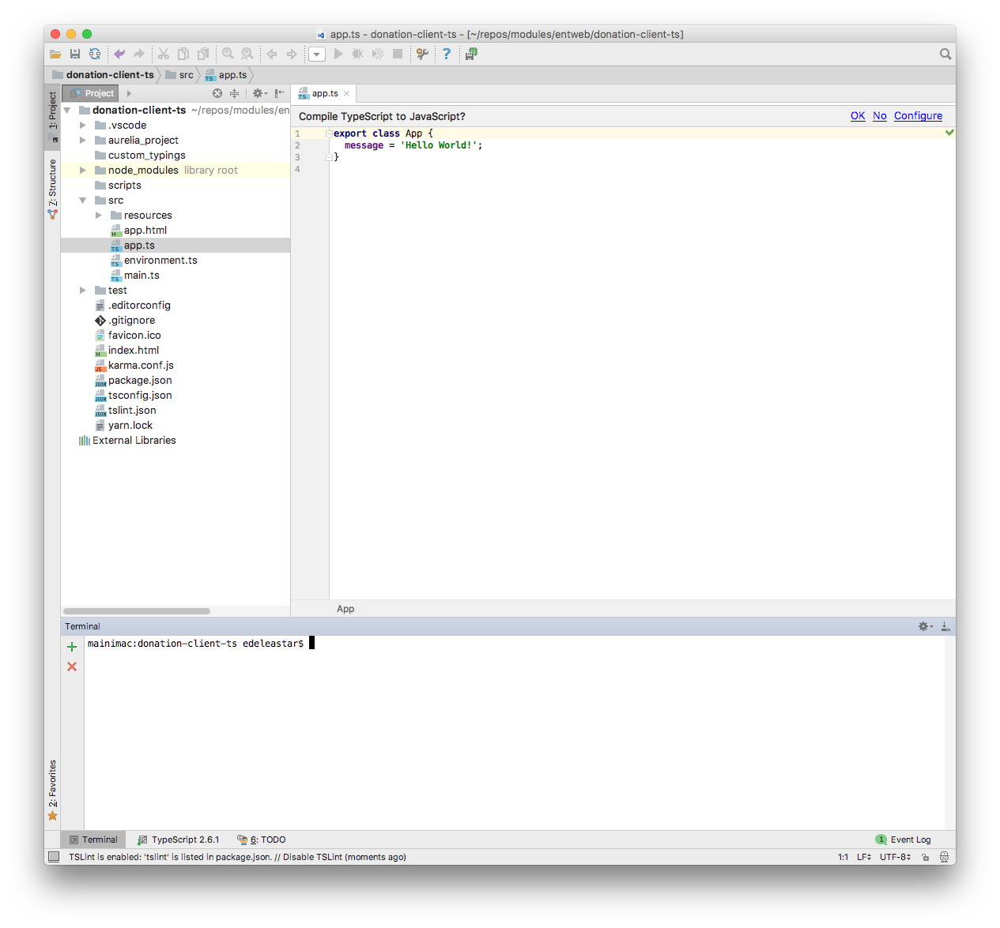

# Starter Project

If you are not familiar with Typescript - it might be worth a quick review of the language here:

- <https://www.typescriptlang.org/docs/handbook/typescript-in-5-minutes.html>

Make sure you have the latest typescript and aureli-cli installed on your workstation:

~~~
npm install typescript -g
npm install aurelia-cli -g
~~~

Create a new Aurelia project:

~~~
au new donstion-client-ts
~~~

Make sure to select [2] for typescript:

~~~
                      _ _          ____ _     ___
  __ _ _   _ _ __ ___| (_) __ _   / ___| |   |_ _|
 / _` | | | | '__/ _ \ | |/ _` | | |   | |    | |
| (_| | |_| | | |  __/ | | (_| | | |___| |___ | |
 \__,_|\__,_|_|  \___|_|_|\__,_|  \____|_____|___|

Would you like to use the default setup or customize your choices?

1. Default ESNext (Default)
   A basic web-oriented setup with Babel and RequireJS for modern JavaScript development.
2. Default TypeScript
   A basic web-oriented setup with TypeScript and RequireJS for modern JavaScript development.
3. Custom
   Select loaders (requirejs/systemjs), bundlers (cli/webpack), transpilers, CSS pre-processors and more.

[Default ESNext]>2
~~~

Accept all other defaults.

You should be able to immediately open the project in Webstorm.

When invited to compile Typescript to Javascript - press 'OK'

