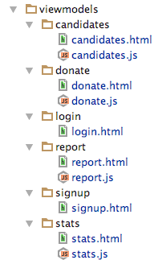

# Viewmodels

We will now restructure the `viewmodels` folder, encapsulating each view/viewmodel in its own directory like this:

The logged in element in `app.html` will need to reflect the changed paths:

~~~
    ...
      

        <aside class="column">
          <compose view-model="./viewmodels/donate/donate"></compose>
        </aside>
        <article class="column">
          <compose view-model="./viewmodels/report/report"></compose>
        </article>
        <article class="column">
          <compose view-model="./viewmodels/candidates/candidates"></compose>
        </article>
        <article class="column">
          <compose view-model="./viewmodels/stats/stats"></compose>
        </article>
      

    ...
~~~

Verify that everything works before proceeding to the next steps (make sure the import paths within each viewmodel are adjusted appropriately)

Notice that signup and login are views without viewmodels. Before we bring in these, introduce this new message class:

## src/services/messages.js

~~~
...

export class LoginStatus {
  constructor(status) {
    this.status = status;
  }
}
~~~

Now bring in the viewmodels for login & signup:

## src/viewmodels/login/login.js

~~~
import {inject} from 'aurelia-framework';
import {EventAggregator} from 'aurelia-event-aggregator';
import DonationService from '../../services/donation-service';
import {LoginStatus} from '../../services/messages';

@inject(EventAggregator, DonationService)
export class Login {

  email = 'marge@simpson.com';
  password = 'secret';

  constructor(ea, ds) {
    this.ea = ea;
    this.donationService = ds;
    this.prompt = '';
  }

  login(e) {
    console.log(`Trying to log in ${this.email}`);
    const status = this.donationService.login(this.email, this.password);
    this.ea.publish(new LoginStatus(status));
  }
}
~~~

## src/viewmodels/signup/signup.js

~~~
import {inject} from 'aurelia-framework';
import {EventAggregator} from 'aurelia-event-aggregator';
import DonationService from '../../services/donation-service';
import {LoginStatus} from '../../services/messages';

@inject(EventAggregator, DonationService)
export class Signup {

  firstName = 'Marge';
  lastName = 'Simpson';
  email = 'marge@simpson.com';
  password = 'secret';

  constructor(ea, ds) {
    this.ea = ea;
    this.donationService = ds;
  }

  register(e) {
    this.showSignup = false;
    this.donationService.register(this.firstName, this.lastName, this.email, this.password);
    const status = this.donationService.login(this.email, this.password);
    this.ea.publish(new LoginStatus(status));
  }
}
~~~

And this is the revised `app` viewmodel + view:

## /src/app.js

~~~
import {inject} from 'aurelia-framework';
import {EventAggregator} from 'aurelia-event-aggregator';
import DonationService from './services/donation-service';
import {LoginStatus} from './services/messages';

@inject(EventAggregator, DonationService)
export class App {

  loggedIn = false;
  showSignup = false;

  constructor(ea, ds) {
    this.donationService = ds;
    ea.subscribe(LoginStatus, msg => {
      this.loggedIn = msg.status.success;
    });
  }

  signup() {
    this.showSignup = true;
  }

  logout() {
    console.log('Logging out`');
    this.loggedIn = false;
  }
}
~~~

## src/app.html

~~~
<template>

  

    <nav class="ui inverted menu">
      <header class="header item"><a href="/"> Donation </a></header>
      

        

          <a class="item" click.trigger="signup()"> Signup </a>
        

        

          <a class="item" click.trigger="logout()"> Logout </a>
        

      

    </nav>

    <section class="ui four column stackable grid basic segment">
      

        

          <section class="ui five wide column">
            <compose view-model="./viewmodels/login/login"></compose>
          </section>
        

        

          <section class="ui five wide column">
            <compose view-model="./viewmodels/signup/signup"></compose>
          </section>
        

      

      

        <aside class="column">
          <compose view-model="./viewmodels/donate/donate"></compose>
        </aside>
        <article class="column">
          <compose view-model="./viewmodels/report/report"></compose>
        </article>
        <article class="column">
          <compose view-model="./viewmodels/candidates/candidates"></compose>
        </article>
        <article class="column">
          <compose view-model="./viewmodels/stats/stats"></compose>
        </article>
      

    </section>
  

</template>
~~~

Get all this working now. Study carefully the login, app and signup viewmodels. Notice how they are communicating via the event aggregator - and the message `LoginStatus`. See if you can follow the flow control. Remember, you can place breakpoints in the source (via Chrome developer tools) and follow this more closely.

