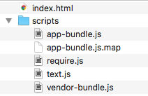

#Solution

Archive of the lab so far:

- <https://bitbucket.org/edeleastar/donation-client/commits/tag/aurelia.3.end>

## Exercise 1: Deployment

As an experiment, create a copy of the donation-client project, call it `donation-client-experiment`.

In the experiment version, delete all files `except` the following:

- index.html
- scripts/*.*

Open the index.html file directly in a browser - the app should behave as previously.

Create a new git repository for the experiment - and commit all sources (that remain afgter our delete step)  to `gh-pages` branch. Push the repo as a new project to your github account. If everything goes according to plan, the app should be live with the url 'http://youraccount.github.com/donation-client-experiment' url

Examples:

The repository here is the experiment repo - note the branch name:

- <https://github.com/edeleastar/donation-client-experiment>

This is automatically published here:

- <https://edeleastar.github.io/donation-client-experiment/>

## Exercises 2: Stats Viewmodel

Run the app and look at the stats view. It seems to be perpetually set to 0. Why is this? Can you find a way of it displaying the correct view?

HINT: You should look at the `Component Lifecycle` documentation:

- <http://aurelia.io/hub.html#/doc/article/aurelia/framework/latest/creating-components/2>

In particular, the `attached` event/method.

## Exercise 3: Composite View/Viewmodel.

Build a new view/view model - to appear on the menu as 'dashboard' - which combines all existing views/viewmodels. This view model is visible in the app here:

- <https://edeleastar.github.io/donation-client-experiment/>

