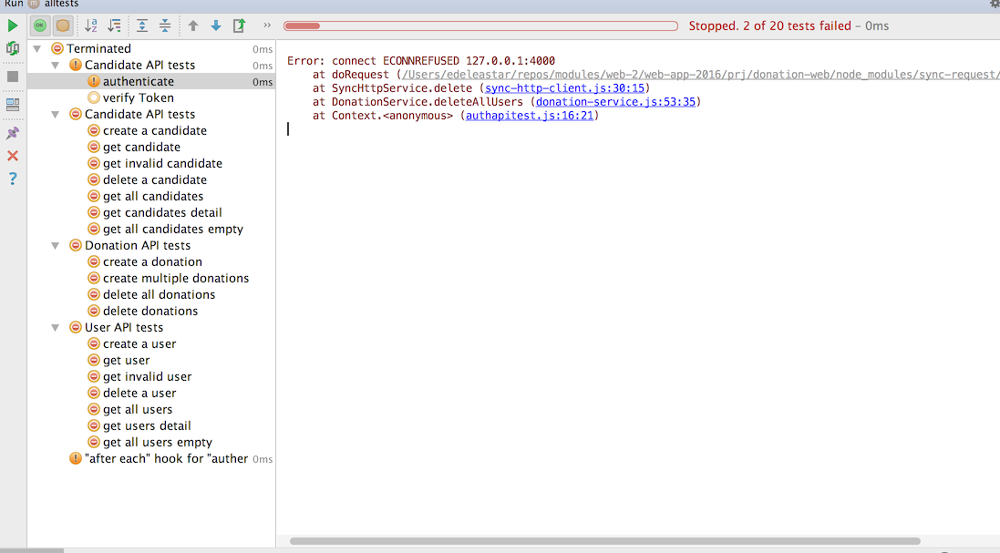
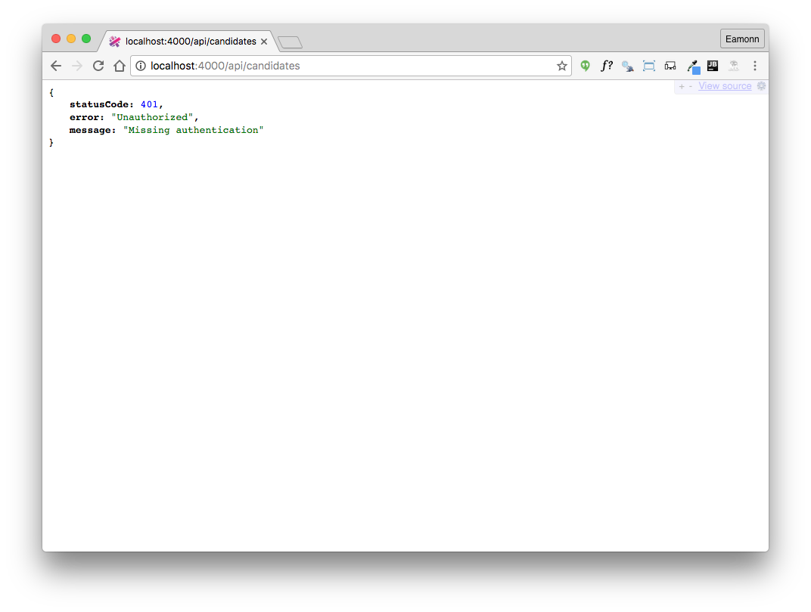

# Securing API Routes

Now that we have established the basic mechanism, we can incorporate jwt auth into the app itself.

## app/api/utils.js

We first need a validation function:

~~~
...
const User = require('../models/user');
...

exports.validate = function (decoded, request, callback) {
  User.findOne({ _id: decoded.id }).then(user => {
    if (user != null) {
      callback(null, true);
    } else {
      callback(null, false);
    }
  }).catch(err => {
    callback(null, false);
  });
};

~~~

This function is required by the jwt validation strategy we are going to introduce. It will be passed the decoded token and will attempt to validate it. For our purposes, it is valid if it contains and ID for user in our database.

## index.js

Now we can register the plugin:

~~~
...
server.register([require('inert'), require('vision'), require('hapi-auth-cookie'), require('hapi-auth-jwt2')], err => {
...
~~~

Then we define a new strategy, which will be in addition to the strategy already in place:

~~~
...
const utils = require('./app/api/utils.js');
...

  server.auth.strategy('jwt', 'jwt', {
    key: 'secretpasswordnotrevealedtoanyone',
    validateFunc: utils.validate,
    verifyOptions: { algorithms: ['HS256'] },
  });

~~~

`validateFunc` is specified here as part of the strategy.

## app/api/*api,js

We now mark all of our api routes with this jwt strategy, replacing:

~~~
  auth: false,
~~~

with

~~~
  auth: {
    strategy: 'jwt',
  },
~~~

The ONE exception is the authenticate strategy, which must remain unguarded:

~~~
exports.authenticate = {

  auth: false,
...
~~~

(Otherwise users could not attempt to authenticate!).

Try running all tests now:

As we have guarded all the routes, all tests fail as our tests do not attempt any authentication (yet).

If you try to access the api from a browser we see similar problems:

