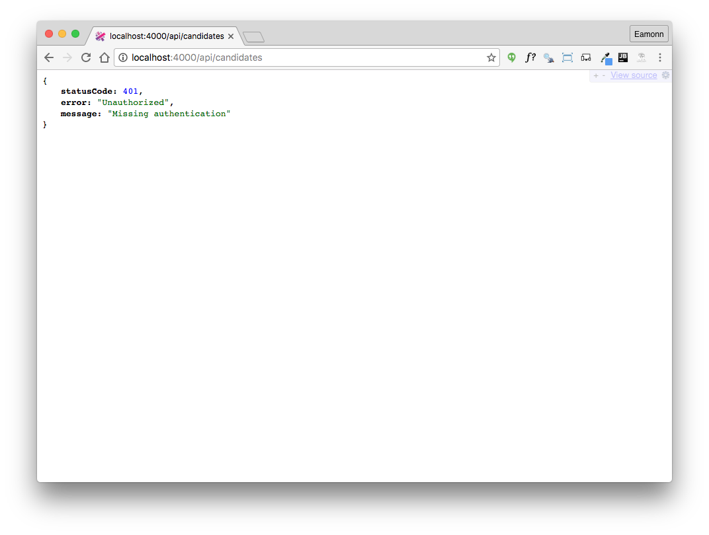

# Jwt Test Support Classes

All of our api routes are not reporting a missing authentication error:

This is because we are not providing the jwt token upon access. As we have already encapsulate http access in our tests, we can introduce jwt auth into the tests reasonably cleanly.

##test/sync-http-client.js

This is a reimplementation of our lowest level htpp encapsulation class:

~~~
var request = require('sync-request');

class SyncHttpService {

  constructor(baseUrl) {
    this.baseUrl = baseUrl;
    this.authHeadder = null;
  }

  setAuth(url, user) {
    const res = request('POST', this.baseUrl + url, { json: user });
    if (res.statusCode == 201) {
      var payload = JSON.parse(res.getBody('utf8'));
      if (payload.success) {
        this.authHeadder = { Authorization: 'bearer ' + payload.token, };
        return true;
      }
    }

    this.authHeadder = null;
    return false;
  }

  clearAuth() {
    this.authHeadder = null;
  }

  get(url) {
    var returnedObj = null;
    var res = request('GET', this.baseUrl + url, { headers: this.authHeadder });
    if (res.statusCode < 300) {
      returnedObj = JSON.parse(res.getBody('utf8'));
    }

    return returnedObj;
  }

  post(url, obj) {
    var returnedObj = null;
    var res = request('POST', this.baseUrl + url, { json: obj, headers: this.authHeadder });
    if (res.statusCode < 300) {
      returnedObj = JSON.parse(res.getBody('utf8'));
    }

    return returnedObj;
  }

  delete(url) {
    var res = request('DELETE', this.baseUrl + url, { headers: this.authHeadder });
    return res.statusCode;
  }
}

module.exports = SyncHttpService;

~~~

It included new methods `setAuth` and `clearAuth`, which manage the jwt tokens:

- `setAuth` requests a token from the server, and stores in in an `authHeader` property.
- `clearAuth` clears out this property.

`get`, `post` and `delete` then include this header as part of all requests.

## test/donation-service.js

In the `DonationService` class, delete the existing `authenticate` method, replacing with `login` and `logout`:

~~~
  login(user) {
    return this.httpService.setAuth('/api/users/authenticate', user);
  }

  logout() {
    this.httpService.clearAuth();
  }

~~~

