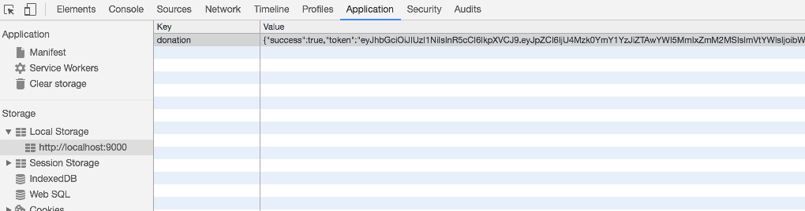

# Storing Tokens

We can save the tokens in `Local Storage` (in the browser), which might be useful in certain circumstances.

In the authenticate method in `AsyncHttpClient` we can store the token:

## src/services/async-http-client.js

~~~
 authenticate(url, user) {
    ...
      if (status.success) {
        localStorage.donation = JSON.stringify(response.content);
        this.http.configure(configuration => {
          configuration.withHeader('Authorization', 'bearer ' + response.content.token);
        });
    ...
    ...
  }
~~~

This stores the token in the key `donation`. We can inspect this in the browser developer tools:

We should takes steps to explicitly clear the token from local storage in our `clearAuthentication()` method:

## src/services/async-http-client.js

~~~
  clearAuthentication() {
    localStorage.donation = null;
    this.http.configure(configuration => {
      configuration.withHeader('Authorization', '');
    });
  }
~~~

Try the following experiment. Log in to the service - and then exit the browser (without logging out). Open the browser again - and see if the token is still in local storage.

Because it should be - we can adapt the app to bypass the login screen in this situation (next step).